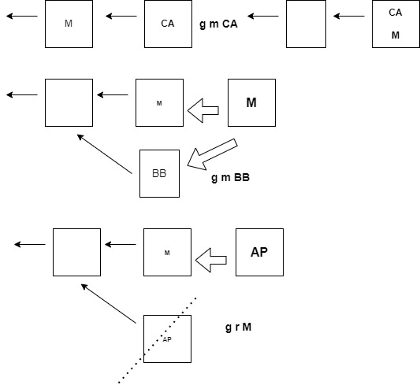

<h1>Anotacoes de Estudo</h1>

 

Vamos começar com o que está sozinho. O _Remote Repository_ é para onde você envia as alterações quando deseja compartilhá-las com outras pessoas e de onde obtém as alterações. Se você já usou outros sistemas de controle de versão, não há nada de interessante nisso.

O _Development Environment_ é o que você possui na sua máquina local.
As três partes são seu _Working Directory_, a _Staging Area_ e o _Local Repository_. Aprenderemos mais sobre eles quando começarmos a usar o git

Escolha um local em que você deseja colocar seu _Development Environment_.
Basta ir para a sua pasta pessoal ou para onde você quiser colocar seus projetos. Você não precisa criar uma nova pasta para o seu _Dev Environment_.
